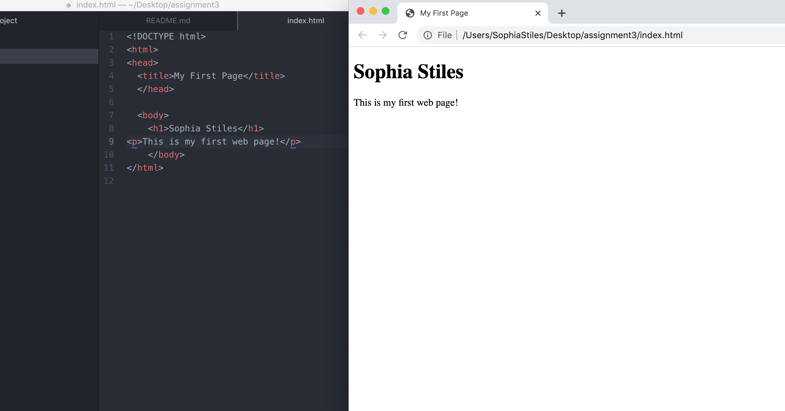

When you enter a Web address URL in your browser, it sends an HTTP command to the Web server directing it to fetch and transmit the requested Web page and display the information in your browser.

A markup language is a computer language that uses tags to define elements within a document. One example may be HTML

 
 
