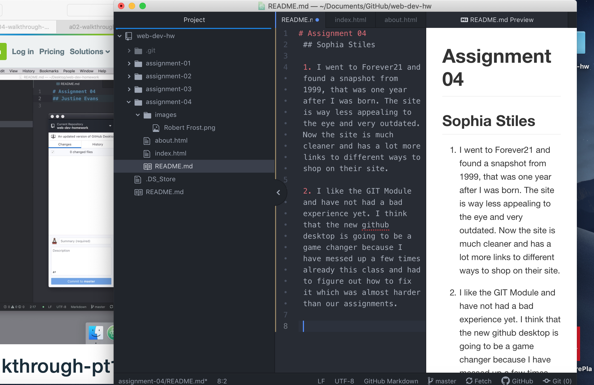

# Assignment 04
 ## Sophia Stiles

 1. I went to Forever21 and found a snapshot from 1999, that was one year after I was born. The site is way less appealing to the eye and very outdated. Now the site is much cleaner and has a lot more links to different ways to shop on their site.

 2. I like the GIT Module and have not had a bad experience yet. I think that the new github desktop is going to be a game changer because I have messed up a few times already this class and had to figure out how to fix it which was almost harder than our assignments.

 
