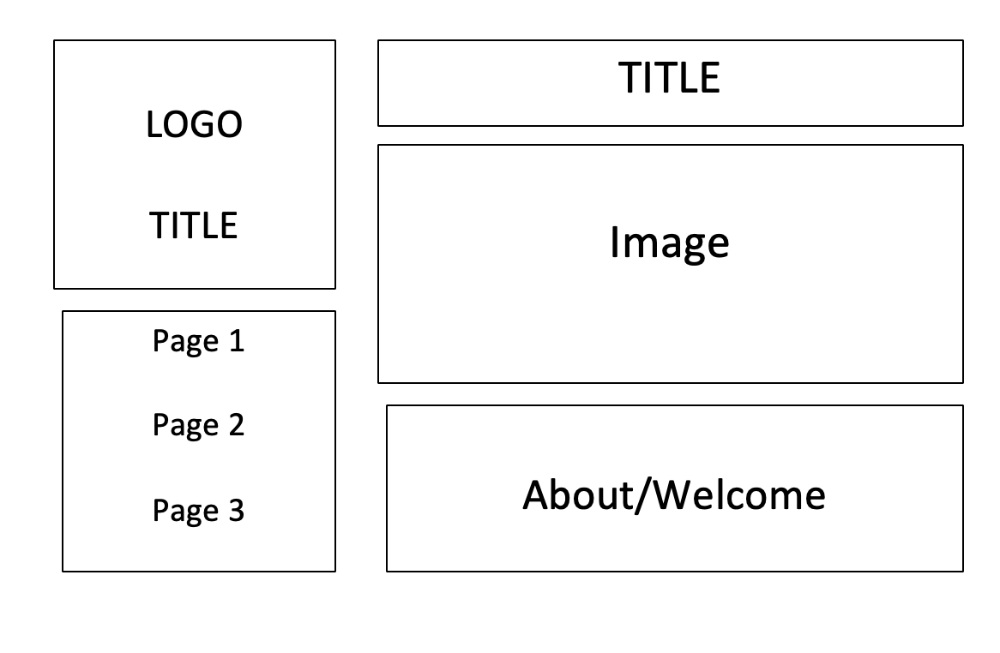

1. Padding is what you apply to an element if you want it to have padding on each side of the element. Margins are for a specific space away from the edges of the web page. Borders are the outline around an element. Border-radius is another border setting you can apply where it rounds the corners of a border.

3.This was hard, I did the same thing as weeks before using the moodle page and walkthrough. Also used atom and github, this was just a lot of trial and error for me.
